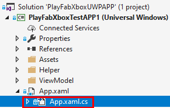
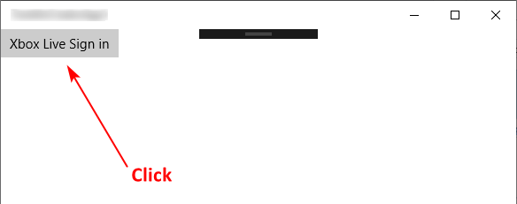
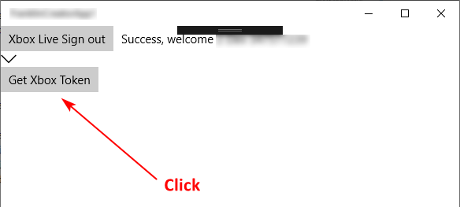
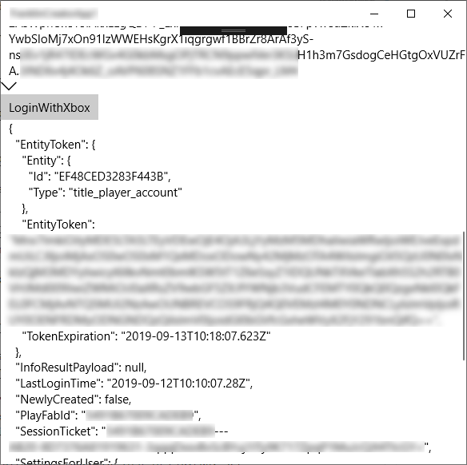
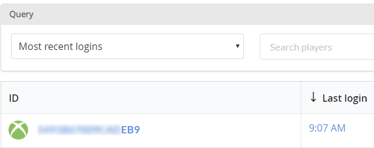

# PlayFab Authentication via Xbox Live Sample
This repo contains the samples that demonstrate the code flow of PlayFab Authentication via Xbox Live

## Universal Windows Platform Integrated PlayFab Authentication via Xbox Live Sample

These samples require Visual Studio 2017 Update 4 or higher and the Windows Software Development Kit (SDK) version 15063 for Windows 10.

Firstly, please follow [Xbox Live doc](https://docs.microsoft.com/en-us/gaming/xbox-live/get-started/get-started_nav) to join a dev program and setup Xbox Live dev environment/IDE. In this sample, we use [Creators Program](https://www.xbox.com/en-US/developers/creators-program) as an example:
1. Open a developer account: https://docs.microsoft.com/en-us/windows/uwp/publish/opening-a-developer-account
2. Create a new app in Partner Center: [Create your app by reserving a name](https://docs.microsoft.com/en-us/windows/uwp/publish/create-your-app-by-reserving-a-name) & [Setting up a game at Partner Center](https://docs.microsoft.com/en-us/gaming/xbox-live/get-started/setup-partner-center/setup-partner-center_nav).<br>
In this step, you can get **PrimaryServiceConfigId (SCID)**, **Title ID**, **Sandbox ID** & **Test Account**
3. Switch your device's development sandbox: [Xbox Live sandboxes for Creators Program developers](https://docs.microsoft.com/en-us/gaming/xbox-live/get-started-with-creators/xbox-live-sandboxes-creators). You can test login via Xbox App if the dev device is PC and OS is Windows 10
4. Clone repo and open .sln file using Visual Studio
5. Open `XboxServices.config` file and fill in the **PrimaryServiceConfigId (SCID)**, **Title ID** [***Step 2***]
6. **Associate App with the Store**. Visual Studio can associate your package with the Store. 
    1. In **Solution Explorer**, right-click your project and then select **Store** > **Associate App with the Store**.

    2. In the **Associate Your App with the Microsoft Store** dialog box, click **Next**. You'll be prompted to sign in to the Microsoft Store.

    3. On the **Sign In** page, sign in to the Microsoft Store using your developer account [***Step 1***] and then click **Next**.

    4. On the **Select an app name** page, select the app you have created in ***Step 2***.

    5. After an app name is selected, click **Next**.

    6. On the summary page, review the values that you have selected. If it looks good, click **Associate**. Otherwise, click **Previous** to go back and fix any errors. Clicking **Associate** automatically downloads the publisher display name and other values into the app package manifest.
   
    7. When you associate your app, some of the fields in the Packaging tab of the manifest designer are automatically updated.
7. Open App.xaml.cs file and replace PLAYFAB_TITLE_ID with your own<br>
    
    ```
    // Replace PLAYFAB_TITLE_ID with your own
    public const string PlayfabTitleId = "PLAYFAB_TITLE_ID";
    ```
8. Change project Target Platform to x64 and start debugging. You will see this UI:


9. After you successfully log in to Xbox Live, click the **Get Xbox Token** Button


    In this step, we need to call Xbox Live GetTokenAndSignature API：<br>
    `GetTokenAndSignature("POST", "https://playfabapi.com/ ", "")`<br>
    In the response, you can get the Xbox token in the `Token` data field.
    **Note that the trailing slash in the URL is important.**
10. After getting the Xbox Token, setting the `XboxToken` property with that token and call PlayFab [LoginWithXbox](https://docs.microsoft.com/en-us/rest/api/playfab/client/authentication/loginwithxbox?view=playfab-rest) API to sign in. 
In this sample, click the **LoginWithXbox** button, you will get the response from PlayFab<br>

11. All down! Check out your player in PlayFab Game Manager, like this:<br>


## Contributions

We welcome your Pull Request, input on issues and suggestions for new samples.

This project has adopted the [Microsoft Open Source Code of Conduct](https://opensource.microsoft.com/codeofconduct/).